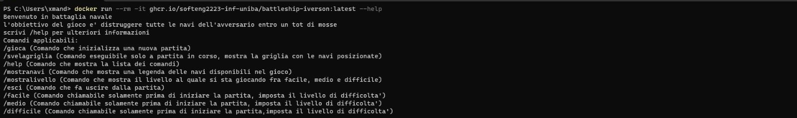
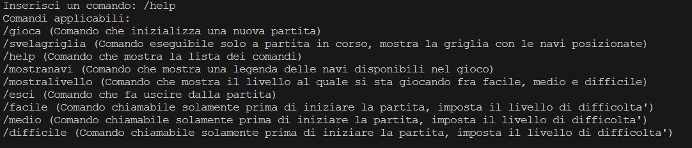

# Report
---
## INDICE:
- 1)INTRODUZIONE 
- 2)MODELLO DI DOMINIO
- 3)REQUISITI SPECIFICI
  - 3.1) REQUISITI FUNZIONALI
  - 3.2) REQUISITI NON FUNZIONALI
- 7)MANUALE UTENTE
- 9)RETROSPETTIVA

---
## 1)INTRODUZIONE
Il gioco realizzato è quello della battaglia navale, con una versione a giocatore singolo contro la CPU. Di seguito le regole del gioco:
* Il sistema posiziona casualmente le navi su una griglia 10x10. Le navi posizionate sono molteplici: 
    * Cacciatorpediniere (4 esemplari,2 caselle);
    * Incrociatore (3 esemplari, 3 caselle);
    * Corazzata (2 esemplari, 4 caselle);
    * Portaerei (1 esemplari, 5 caselle).
* Il giocatore cerca di indovinare la posizione delle navi e affondarle 
* Il giocatore vince se affonda tutte le navi prima di esaurire le mosse 
* Il numero di mosse disponibili dipende dalla modalità di gioco (facile/media/difficile/…)

---

## 2)MODELLO DI DOMINIO
Il modello di dominio è un diagramma delle classi con prospettive concettuali, esso è una visuale di concetti caratteristici del dominio studiato

L'entità fondamentale del gioco è la Partita. Una partita si compone di diversi attributi: il numero massimo di errori concessi al giocatore (NumeroMassimoErrori), il numero di tentativi totali effettuati (ColpiTotali), il numero di tentativi falliti (ErroriCorrenti) e uno stato che indica se la partita è effettivamente in corso (StatoDellaPartita). Una Partita si compone anche di una Mappa di Gioco, concetto rappresentante lo spazio dove si trovano le navi da colpire e di conseguenza le posizioni colpibili dal giocatore. Essa si compone di un certo numero di righe, un numero di colonne e una serie di posizioni dove può esserci una nave, l'acqua o un colpo andato a segno/mancato. Una mappa, quindi, si compone di tante navi, in particolare di 10 navi Una nave è caratterizzata dalla sua dimensione, uno stato che afferma se questa sia affondata o meno e una serie di coordinate (da 1 a 5 coordinate possibili) che identificano la sua posizione sulla mappa. Una coordinata è caratterizzata da un numero di riga, un numero di colonna e uno stato che afferma se in quella casella la nave sia stata colpita o meno. Il concetto di nave ha inoltre 4 specializzazioni, rappresentati i 4 tipi di nave disponibili nel gioco: Cacciatorpediniere, Portaerei, Corazzata, Incrociatore.

---
## 3)REQUISITI SPECIFICI
Di seguito si riporta l'elenco dei requisiti che l'applicazione soddisfa, divisi in requisiti funzionali (le funzionalità che devono essere fruibili dall'utente) e requisiti non funzionali (le caratteristiche che l'applicazione dovrà avere in merito alla sua esecuzione):
#### 3.1 REQUISITI FUNZIONALI
Attori/utenti del sistema: giocatore della partita.
* **RF1**: Come giocatore voglio mostrare l'help con elenco comandi
Criteri di accettazione: 

        Al comando /help o invocando l'app con flag --help o -h 
        il risultato è una descrizione concisa, che normalmente appare all'avvio del programma, seguita dalla lista di comandi disponibili, uno per riga, come da esempio successivo: 
            * gioca	 
            * esci 
            ... 

* **RF2**:Come giocatore voglio chiudere il gioco 
Criteri di accettazione: 
        
        Al comando /esci 
        l'applicazione chiede conferma  
        se la conferma è positiva, l'applicazione si chiude restituendo il controllo al sistema operativo 
        se la conferma è negativa, l'applicazione si predispone a ricevere nuovi tentativi o comandi 

* **RF3**:Come giocatore voglio impostare il livello di gioco per variare il numero massimo di tentativi sbagliati 
Criteri di accettazione 

        Al comando /facile  
        l’applicazione risponde con OK e imposta a 50 il numero massimo di tentativi falliti 

        Al comando /medio  
        l’applicazione risponde con OK e imposta a 30 il numero massimo di tentativi falliti 

        Al comando /difficile  
        l’applicazione risponde con OK e imposta a 10 il numero massimo di tentativi falliti 

* **RF4**: Come giocatore voglio mostrare il livello di gioco e il numero massimo di tentativi falliti
Criteri di accettazione: 

        Al comando /mostralivello  

        l’applicazione risponde visualizzando il livello di gioco e il numero di massimo di tentativi falliti 

* **RF5**: Come giocatore voglio mostrare i tipi di nave e il numero  

    Criteri di accettazione: 

        Al comando /mostranavi  

        l’applicazione risponde visualizzando, per ogni tipo di nave, la dimensione in quadrati e il numero di esemplari da affondare: 

        -Cacciatorpediniere 	⊠⊠ 	        esemplari: 4 

        -Incrociatore 	       ⊠⊠⊠ 	        esemplari: 3  

        -Corazzata 		       ⊠⊠⊠⊠ 	        esemplari: 2  

        -Portaerei  	       ⊠⊠⊠⊠⊠ 	esemplari: 1  

* **RF6**: Come giocatore voglio iniziare una nuova partita 

    Criteri di accettazione:

        Al comando /gioca  

        se nessuna partita è in corso l'applicazione imposta causalmente le navi, in orizzontale o in verticale, mostra la griglia vuota e si predispone a ricevere il primo tentativo o altri comandi. 

* **RF7**: Come giocatore voglio svelare la griglia con le navi posizionate 
    Criteri di accettazione:

        Al comando /svelagriglia  

        l’applicazione risponde visualizzando, una griglia 10x10, con le righe numerate da 1 a 10 e le colonne numerate da A a J, e tutte le navi posizionate   

 

#### 3.2 REQUISITI NON FUNZIONALI
**RNF1**: il container docker dell’app deve essere eseguito da terminali che supportano Unicode con encoding UTF-8 o UTF-16. Alcuni dei terminali supportati sono:
*	Terminal di Linux
*	Powershell Windows
*	Git Bash (in questo caso il comando Docker ha come prefisso winpty; es: winpty docker -it ....)

----

## 7)MANUALE UTENTE
Nel caso l'utente avvii il programma senza inserire nessun parametro verrà mostrato questo:

Nel caso l'utente avvii il programma inserendo il parametro "--help" oppure "-help" verrà mostrato questo:

Nel caso l'utente inserisca /help per avere piu' informazioni verrà stampato questo:

Nel caso l'utente inserisca il comando /gioca verrà iniziata una nuova partita:

Nel caso l'utente inserisca il comando /mostranavi verrà stampata una legenda delle navi disponibili:

Nel caso l'utente (a partita in corso) inserisca il comando /svelagriglia verrà mostrata la griglia con le navi posizionate:

Nel caso l'utente inserisca il comando /mostralivello verrà visualizzato il livello al quale l'utente sta giocando, il livello è impostabile quando la partita inizia (tramite i comandi "/facile", "/medio", "/difficile") e non è modificabile a partita in corso:

Nel caso l'utente inserisca il comando "/esci" prima gli verrà chiesta conferma di uscita e in seguito ad un risposta affermativa l'applicazione si chiuderà:

---

## 9)RETROSPETTIVA
Di seguito la retrospettiva degli sprint precedenti. Sono state raccolte le  osservazioni e le opinioni dei membri del team riguardo al lavoro svolto in un modello di retrospettiva "sad,mad,glad".
### 9.1) SPRINT 0

### 9.1) SPRINT 1

