# Report
---
## INDICE:
- 1)INTRODUZIONE 
- 2)MODELLO DI DOMINIO
- 3)REQUISITI SPECIFICI
  - 3.1) REQUISITI FUNZIONALI
  - 3.2) REQUISITI NON FUNZIONALI
- 4)SYSTEM DESIGN
- 5)OO DESIGN
   - 5.1) DIAGRAMMA DELLE CLASSI
   - 5.2) DIAGRAMMA DI SEQUENZA
- 6)RIEPILOGO DEI TEST
- 7)MANUALE UTENTE
- 8)PROCESSO DI SVILUPPO E ORGANIZZAZIONE DEL LAVORO
   - 8.1) SPRINT 0     
   - 8.2) SPRINT 1     
   - 8.3) SPRINT 2     
- 9)RETROSPETTIVA
   - 9.1) SPRINT 0
   - 9.2) SPRINT 1   

---
## 1)INTRODUZIONE
Il gioco realizzato è quello della battaglia navale, con una versione a giocatore singolo contro la CPU. Di seguito le regole del gioco:
* Il sistema posiziona casualmente le navi su una griglia 10x10. Le navi posizionate sono molteplici: 
    * Cacciatorpediniere (4 esemplari,2 caselle);
    * Incrociatore (3 esemplari, 3 caselle);
    * Corazzata (2 esemplari, 4 caselle);
    * Portaerei (1 esemplari, 5 caselle).
* Il giocatore cerca di indovinare la posizione delle navi e affondarle 
* Il giocatore vince se affonda tutte le navi prima di esaurire le mosse 
* Il numero di mosse disponibili dipende dalla modalità di gioco (facile/media/difficile/…)

---

## 2)MODELLO DI DOMINIO
Il modello di dominio è un diagramma delle classi con prospettive concettuali, esso è una visuale di concetti caratteristici del dominio studiato

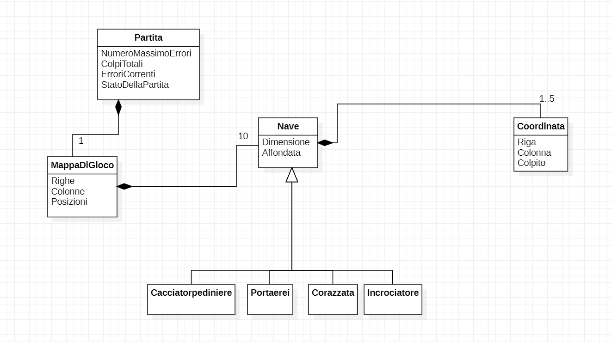

L'entità fondamentale del gioco è la Partita. Una partita si compone di diversi attributi: il numero massimo di errori concessi al giocatore (NumeroMassimoErrori), il numero di tentativi totali effettuati (ColpiTotali), il numero di tentativi falliti (ErroriCorrenti), uno stato che indica se la partita è effettivamente in corso (StatoDellaPartita), le dimensioni massime della mappa, il tempo massimo per l’esecuzione delle partita, il tempo trascorso a partire dall’inizio della partita, il livello di difficoltà scelto e il numero di tentativi falliti per ogni possibile livello di difficoltà. Una Partita si compone anche di una Mappa di Gioco, concetto rappresentante lo spazio dove si trovano le navi da colpire e di conseguenza le posizioni colpibili dal giocatore. Essa si compone di un certo numero di righe, un numero di colonne e una serie di posizioni dove può esserci una nave, l'acqua o un colpo andato a segno/mancato. Una mappa, quindi, si compone di tante navi, in particolare di 10 navi Una nave è caratterizzata dalla sua dimensione, uno stato che afferma se questa sia affondata o meno e una serie di coordinate (da 1 a 5 coordinate possibili) che identificano la sua posizione sulla mappa. Una coordinata è caratterizzata da un numero di riga, un numero di colonna e uno stato che afferma se in quella casella la nave sia stata colpita o meno. Il concetto di nave ha inoltre 4 specializzazioni, rappresentati i 4 tipi di nave disponibili nel gioco: Cacciatorpediniere, Portaerei, Corazzata, Incrociatore.

---
## 3)REQUISITI SPECIFICI
Di seguito si riporta l'elenco dei requisiti che l'applicazione soddisfa, divisi in requisiti funzionali (le funzionalità che devono essere fruibili dall'utente) e requisiti non funzionali (le caratteristiche che l'applicazione dovrà avere in merito alla sua esecuzione):
#### 3.1 REQUISITI FUNZIONALI
Attori/utenti del sistema: giocatore della partita.
* **RF1**: Come giocatore voglio mostrare l'help con elenco comandi
Criteri di accettazione: 

        Al comando /help o invocando l'app con flag --help o -h 
        il risultato è una descrizione concisa, che normalmente appare all'avvio del programma, seguita dalla lista 
        di comandi disponibili, uno per riga, come da esempio successivo: 
            * gioca	 
            * esci 
            ... 

* **RF2**:Come giocatore voglio chiudere il gioco 
Criteri di accettazione: 
        
        Al comando /esci 
        l'applicazione chiede conferma  
        se la conferma è positiva, l'applicazione si chiude restituendo il controllo al sistema operativo 
        se la conferma è negativa, l'applicazione si predispone a ricevere nuovi tentativi o comandi 

* **RF3**:Come giocatore voglio impostare il livello di gioco per variare il numero massimo di tentativi sbagliati 
Criteri di accettazione 

        Al comando /facile  
        l’applicazione risponde con OK e imposta a 50 il numero massimo di tentativi falliti 

        Al comando /medio  
        l’applicazione risponde con OK e imposta a 30 il numero massimo di tentativi falliti 

        Al comando /difficile  
        l’applicazione risponde con OK e imposta a 10 il numero massimo di tentativi falliti 

* **RF4**: Come giocatore voglio mostrare il livello di gioco e il numero massimo di tentativi falliti
Criteri di accettazione: 

        Al comando /mostralivello  

        l’applicazione risponde visualizzando il livello di gioco e il numero di massimo di tentativi falliti 

* **RF5**: Come giocatore voglio mostrare i tipi di nave e il numero  

    Criteri di accettazione: 

        Al comando /mostranavi  

        l’applicazione risponde visualizzando, per ogni tipo di nave, la dimensione in quadrati e il numero 
        di esemplari da affondare: 

        -Cacciatorpediniere 	⊠⊠ 	        esemplari: 4 

        -Incrociatore 	       ⊠⊠⊠ 	        esemplari: 3  

        -Corazzata 		       ⊠⊠⊠⊠ 	        esemplari: 2  

        -Portaerei  	       ⊠⊠⊠⊠⊠ 	esemplari: 1  

* **RF6**: Come giocatore voglio iniziare una nuova partita 

    Criteri di accettazione:

        Al comando /gioca  

        se nessuna partita è in corso l'applicazione imposta causalmente le navi, in orizzontale o in verticale, mostra la griglia vuota e si predispone a ricevere il primo tentativo o altri comandi. 

* **RF7**: Come giocatore voglio svelare la griglia con le navi posizionate 
    Criteri di accettazione:

        Al comando /svelagriglia  

        l’applicazione risponde visualizzando, una griglia 10x10, con le righe numerate da 1 a 10 e le colonne numerate da A a J, e tutte le navi posizionate   

* **RF8**: Come giocatore voglio impostare il numero massimo di tentativi falliti per livello di gioco 
    Criteri di accettazione:

        Al comando /facile numero
        l’applicazione risponde con OK e imposta a numero il numero massimo di tentativi falliti

        Al comando /medio numero
        l’applicazione risponde con OK e imposta a numero il numero massimo di tentativi falliti

        Al comando /difficile numero
        l’applicazione risponde con OK e imposta a numero il numero massimo di tentativi falliti

* **RF9**: Come giocatore voglio impostare direttamente il numero massimo di tentativi che si possono fallire
    Criteri di accettazione:

        Al comando /tentativi numero
        l’applicazione risponde con OK e imposta a numero il numero massimo di tentativi falliti

* **RF10**: Come giocatore voglio impostare la taglia della griglia
    Criteri di accettazione:

        Al comando /standard
        l’applicazione risponde con OK e imposta a 10x10 la dimensione della griglia (è il default)

        Al comando /large
        l’applicazione risponde con OK e imposta a 18x18 la dimensione della griglia 

        Al comando /extralarge
        l’applicazione risponde con OK e imposta a 26x26 la dimensione della griglia 

* **RF11**: Come giocatore voglio impostare il tempo di gioco
        Criteri di accettazione:

        Al comando /tempo numero
        l’applicazione risponde con OK e imposta a numero il numero minuti a disposizione per giocare

* **RF12**: Come giocatore voglio mostrare il tempo di gioco
        Criteri di accettazione:

        Al comando /mostratempo
        l’applicazione risponde visualizzando il numero di minuti
        trascorsi nel gioco e il numero di minuti ancora disponibili

* **RF13**: Come giocatore voglio effettuare un tentativo per colpire una nave
        Criteri di accettazione:

        Digitando una coppia di caratteri separati da un trattino, corrispondenti rispettivamente al numero di
        riga e alla lettera della colonna, (es. B-4), l’applicazione risponde 
        •“acqua” se sulla cella non è posizionata nessuna nave;
        •"colpito" se sulla cella è posizionata una nave;
        •"colpito e affondato" se sulla cella è posizionata una nave ed è l’ultima cella non colpita della nave. 
        Qualunque sia l’esito del tentativo, l’applicazione mostra la griglia con le navi colpite parzialmente 
        o affondate, il numero di tentativi già effettuati, e il tempo trascorso. 
        La partita termina con successo se il tentativo ha affondato l’ultima nave.
        La partita termina con insuccesso se è stato raggiunto il numero massimo di tentativi falliti 
        o se è scaduto il tempo di gioco.

* **RF14**: Come giocatore voglio mostrare la griglia con le navi colpite e affondate
        Criteri di accettazione:

        Al comando /mostragriglia 
        l’applicazione risponde visualizzando, una griglia 10x10, con le righe numerate da 1 a 10 e le colonne
        numerate da A a J, con le navi affondate e le sole parti già colpite delle navi non affondate. 

* **RF15**: Come giocatore voglio mostrare il numero di tentativi già effettuati e il numero di tentativi falliti
        Criteri di accettazione:

        Al comando /mostratentativi 
        l’applicazione risponde visualizzando il numero di tentativi già effettuati, il numero di tentativi falliti 
        e il numero massimo di tentativi falliti

* **RF16**: Come giocatore voglio abbandonare una partita
        Criteri di accettazione:

        Al comando /abbandona
        l'applicazione chiede conferma 
        • se la conferma è positiva, l’applicazione risponde visualizzando sulla griglia la posizione di tutte le
        navi e si predispone a ricevere nuovi comandi 
        • se la conferma è negativa, l'applicazione si predispone a ricevere nuovi tentativi o comandi

#### 3.2 REQUISITI NON FUNZIONALI
**RNF1**: il container docker dell’app deve essere eseguito da terminali che supportano Unicode con encoding UTF-8 o UTF-16. Alcuni dei terminali supportati sono:
*	Terminal di Linux
*	Powershell Windows
*	Git Bash (in questo caso il comando Docker ha come prefisso winpty; es: winpty docker -it ....)

----

## 4)SYSTEM DESIGN
Di seguito viene mostrato il diagramma dei package, ovvero uno schema raffigurante l’organizzazione delle directory del codice e le loro dipendenze. Con dipendenza tra package (indicata da una freccia tratteggiata) si intende la situazione per cui le classi di un package hanno bisogno delle informazioni contenute in un altro package per funzionare

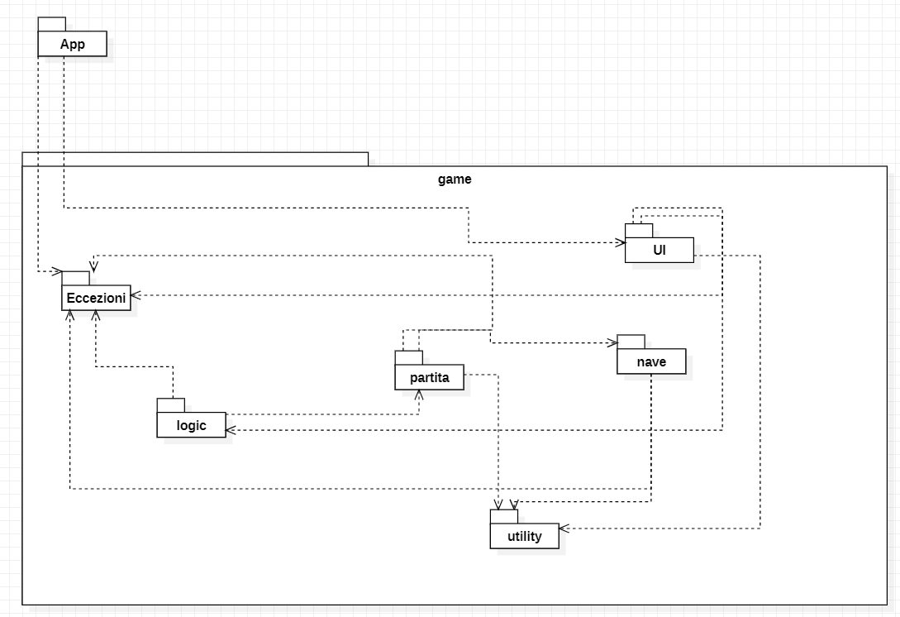

---
## 5)OO DESIGN

### 5.1)DIAGRAMMA DELLE CLASSI
Di seguito si mostrano i diagrammi delle classi rappresentanti i concetti principali dell'applicazione da una prospettiva software.
Sono stati realizzati:
1. Un diagramma delle classi generale
2. 2 diagrammi delle classi specifici per le user story più importanti.
In questi ultimi,sono rappresentati solo  gli elementi (classi,attributi,metodi...) facenti effettivamente parte della realizzazione della specifica user story

- DIAGRAMMA DELLE CLASSI GENERALE
Questo è un diagramma rappresentante tutte le classi coinvolte nell'esecuzione del programma, con i loro attributi,metodi e relazioni
N.B. le classi segnate come "control" sono classi Singleton.

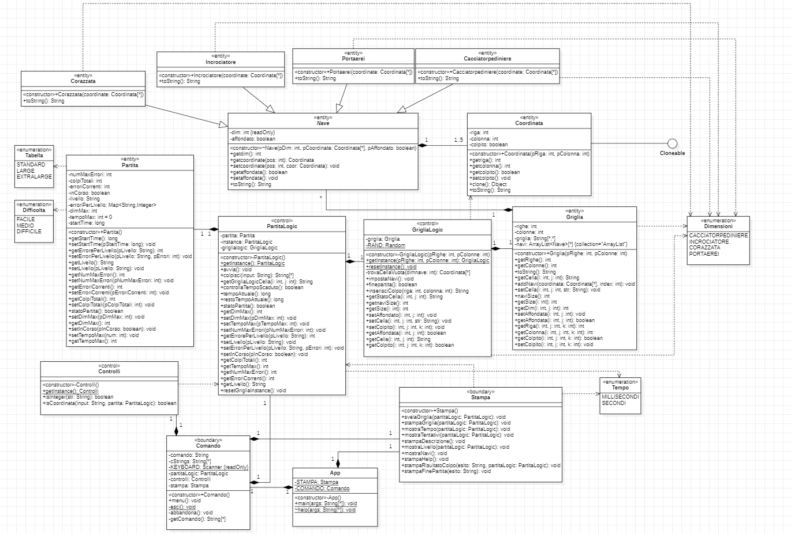

- DIAGRAMMA DELLE CLASSI "GIOCA"
Questo diagramma rappresenta tutte le classi (con opportuni metodi e attributi) coinvolte nella realizzazione della user story: "come giocatore desidero avviare una partita"

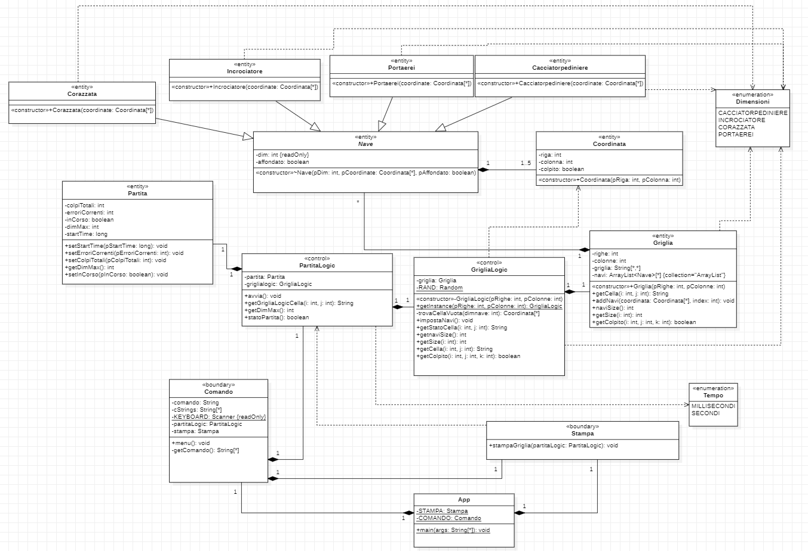

- DIAGRAMMA DELLE CLASSI "COLPISCI"
Questo diagramma rappresenta le classi coinvolte nella realizzazione della user story: "Come giocatore voglio effettuare un tentativo per colpire una nave"

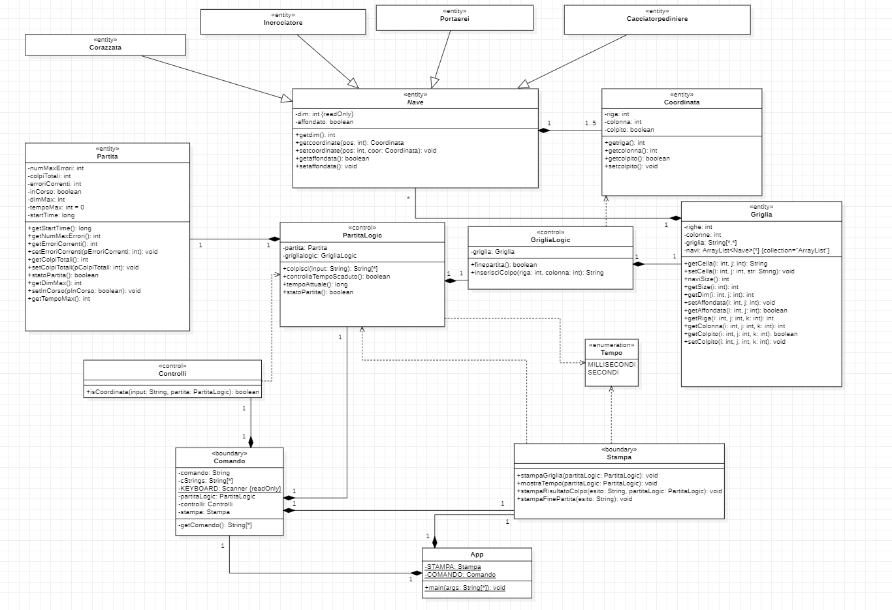

### 5.2) DIAGRAMMA DI SEQUENZA

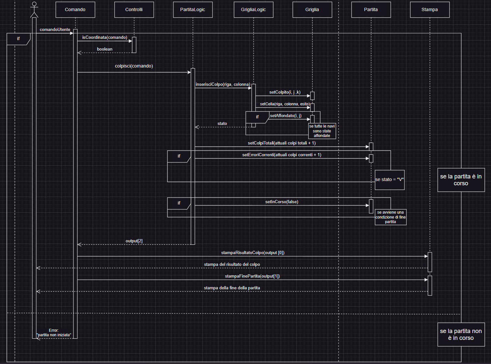

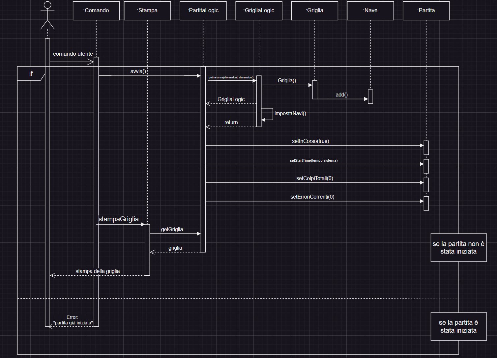

---
## 6)RIEPILOGO DEI TEST
Tutti i casi di test che sono stati eseguiti sono della categoria BlackBox.
I casi di test sulle classi boundary non sono stati eseguiti perché essi dovrebbe controllare ogni singolo inserimento dell’utente, cosa che i casi di test automatici non possono prevedere.
Le classi su cui non sono stati eseguiti i test sono le seguenti:
1) Il package eccezioni con le sue classi: CloneException, NumeroCoordinateException e PosizioneException
2) Il package UI con le sue classi: Comando e Stampa

Casi di test per il package app:
Sono stati generati casi di test automatici in JUnit per il package app contenente una sola  classe: 

- I test AppTest riguardano l’avvio con paramentro “-h” e “- -help”, in particolare che non restituisca vuoto. 

Casi di test per la package logic: 
Sono stati generati casi di test automatici in JUnit per il package logic che si suddividono in 3 diverse classi che sono:

- ControlliTest; I test  riguardano i controlli per l’input, sia in caso di input validi che non validi.

- GrigliaLogicTest; I test su GrigliaLogicTest riguardano i colpi e i lo stato delle celle delle navi, le loro coordinate, le dimensioni delle navi e il loro stato (Affondato, Colpito, ecc...).

- PartitaLogicTest; I test su PartitaLogicTest riguardano i controlli sullo stato della partita, sul colpo (se esso è andato a vuoto o no), sul tempo, sulle dimensioni della griglia di gioco, sugli errori per livello(FACILE, MEDIO E DIFFICILE)  e sulla loro impostazione.

Casi di test per il package nave:
Sono stati generati casi di test automatici in JUnit per il package nave che si suddividono in 6 diverse classi che sono:

- CacciatorpediniereTest;
- CorazzataTest;
- IncrociatoreTest;
- PortaereiTest;

   I test su CacciapediniereTest, CorazzataTest, IncrociatoreTest e PortaereiTest sono tutti dello stesso tipo (cambiano le dimensioni) ed essi riguardano il controllo sul corretto funzionamento del costruttore e del loro posizionamento sulla griglia di gioco.

- NaveTest; I test su NaveTest riguardano l’impostare correttamente le dimensioni, le coordinate e lo stato della nave (se essa è stata affondata o no).

- CoordinataTest; I test su CoordinateTest riguardano la corretta restituzione delle righe e delle colonne, dello stato del colpo, delle coordinate delle navi e della loro clonazione (una volta saputo le coordinate delle navi, esse vengono clonate e impostate sulla griglia di gioco).

Casi di test per il package partita:
Sono stati generati casi di test automatici in JUnit per il package partita che si suddividono in 2 diverse classi che sono:

- GrigliaTest; I test su GrigliaTest riguardano la verifica del numero di righe e di colonne, il corretto valore della singola cella,  la dimensione delle navi, lo stato delle navi e lo stato del colpo.

- PartitaTest; I test su PartitaTest riguardano l’impostazione del livello e i relativi numeri di errori, controllo sugli errori e il loro settaggio, controllo sullo stato dei colpi e della partita, impostazione della griglia di gioco e rispettive dimensioni e il cotrollo sul settaggio del tempo di gioco.

Casi di test per il package utility:
Sono stati generati casi di test automatici in JUnit per il package utility che si suddividono in 4 diverse classi che sono:

- DifficoltaTest; I test su DifficoltaTest riguardano l’impostazione della difficoltà.

- DimensioniTest; I test su DimensioniTest riguardano il controllo sulle dimensioni delle navi e sul numero di esemplari per nave.

- TabellaTest; I test su TabellaTest riguardano l’impostazione della dimensione della griglia di gioco.

- TempoTest; I test su TempoTest riguardano la corretta restituzione del tempo impostato.

---
## 7)MANUALE UTENTE
Nel caso l'utente avvii il programma senza inserire nessun parametro verrà mostrato questo:

Nel caso l'utente avvii il programma inserendo il parametro "--help" oppure "-help" verrà mostrato questo:

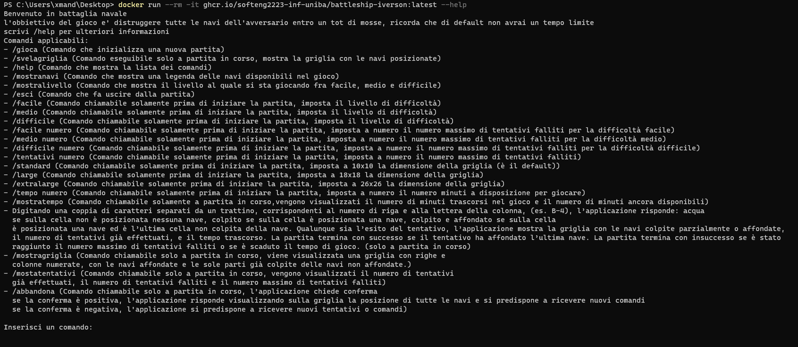

Nel caso l'utente inserisca "/help" per avere piu' informazioni verrà stampato questo:

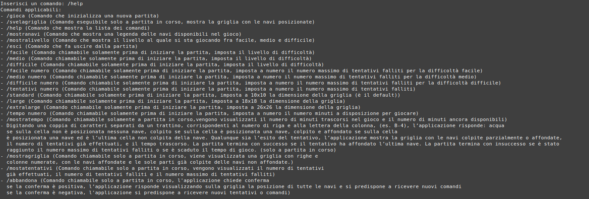

Nel caso l'utente inserisca il comando "/gioca" verrà iniziata una nuova partita:

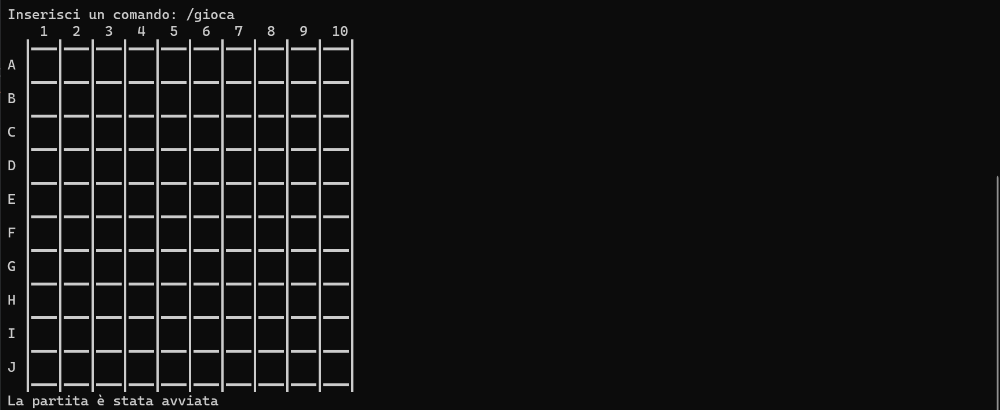

Nel caso l'utente inserisca il comando "/mostranavi" verrà stampata una legenda delle navi disponibili:

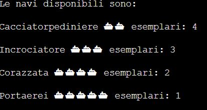

Nel caso l'utente (a partita in corso) inserisca il comando "/svelagriglia" verrà mostrata la griglia con le navi posizionate:

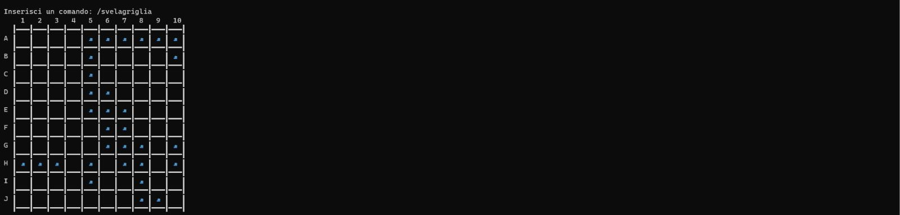

Nel caso l'utente inserisca il comando "/mostralivello" verrà visualizzato la difficoltà alla quale l'utente sta giocando, la difficoltà è impostabile quando la partita non è iniziata (tramite i comandi "/facile", "/medio", "/difficile"; è possibile aggiungere accanto al comando un numero, quel numero diventerà il numero massimo di tentativi falliti per la difficoltà; in caso venga scelta questa opzione bisognerà riselezionare il livello per visualizzare la modifica su di esso (es: se si dovesse digitare "/facile 20" per poter usufruire del nuovo numero di tentativi fallibili bisogna digitare di nuovo "/facile"). In alternativa è possivile inserire il comando "/tentativi numero" che andrà ad impostare il numero massimo di tentativi falliti al numero inserito) e non è modificabile a partita in corso:

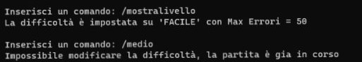

Nel caso l'utente inserisca il comando "/mostratentativi" verranno visualizzati il numero di tentativi già effetuati, il numero di tentativi falliti e il numero massimo di tentativi fallibili. Comando chiamabile solo a partita in corso:

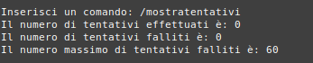

Nel caso l'utente inserisca il comando "/tempo numero", l'applicazione imposterà a numero il tempo a disposizione del giocatore per finire la partita (in minuti). Questo comando è chiamabile solo prima di iniziare la partita:

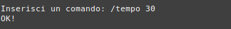

Nel caso l'utente inserisca il comando "/mostratempo" verrà visualizzato il tempo rimasto al giocatore per finire la partita. Questo comando è chiamabile solo a partita in corso:

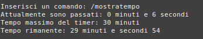

Nel caso l'utente inserisca il comando "/mostragriglia" verrà visualizzata una griglia con righe e colonne numerate e che mostrarà le navi già affondate e le parti di navi colpite. Comando chiamabile solo a partita in corso.

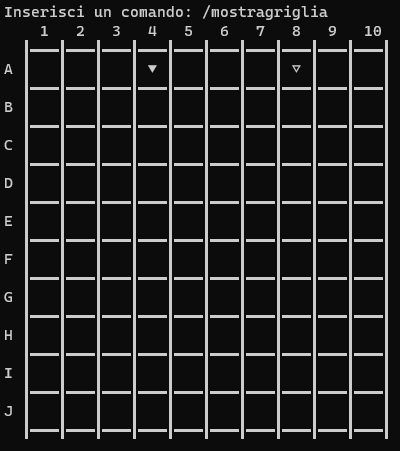

Nel caso l'utente inserisca il comando "/standard" verrà impostata la dimensione della griglia a 10x10 (è il default). Comando chiamabile solo prima di iniziare una partita: 

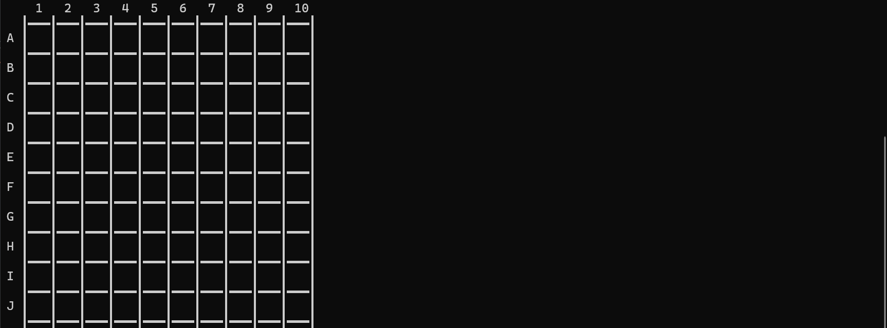

Nel caso l'utente inserisca il comando "/large" verrà impostata la dimensione della griglia a 18x18. Comando chiamabile solo prima di iniziare una partita:

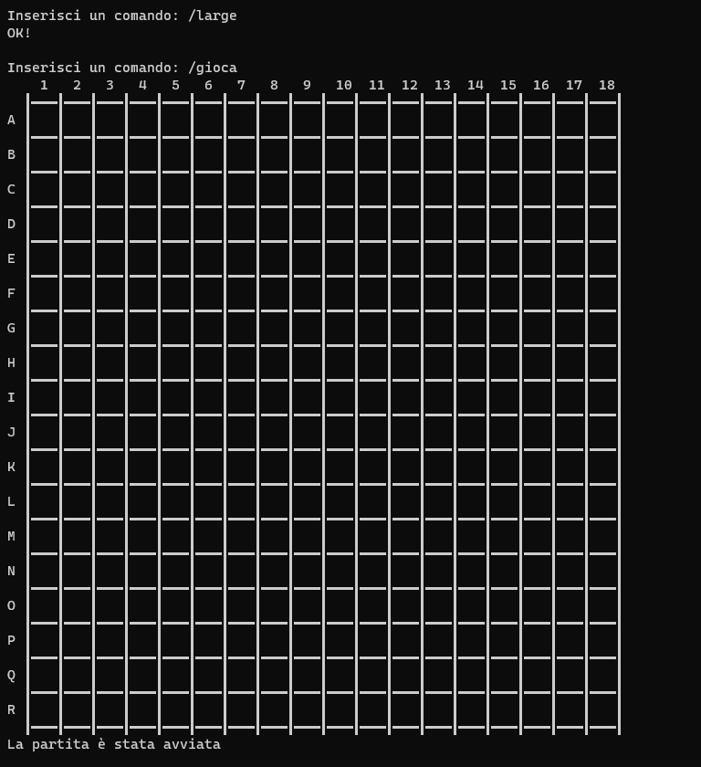

Nel caso l'utente inserisca il comando "/extralarge" verrà impostata la dimensione della griglia a 26x26. Comando chiamabile solo prima di iniziare una partita:

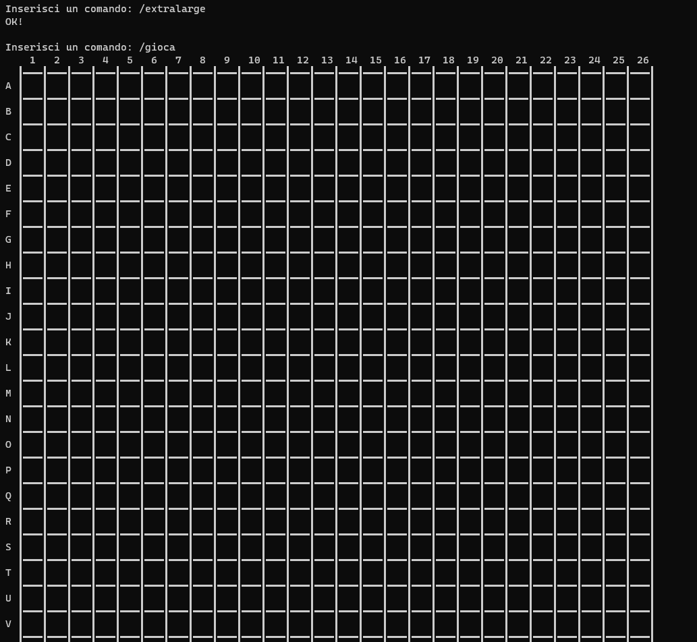

Digitando a partita in corso una coppia di caratteri separati da un trattino, corrispondenti rispettivamente al numero di riga e alla lettera della colonna, (es. B-4), l’applicazione risponde 
• “acqua” se sulla cella non è posizionata nessuna nave;
• "colpito" se sulla cella è posizionata una nave;
• "colpito e affondato" se sulla cella è posizionata una nave ed è l’ultima cella non colpita della nave. 
Qualunque sia l’esito del tentativo, l’applicazione mostra la griglia con le navi colpite parzialmente o affondate, il numero di tentativi già effettuati, e il tempo trascorso. 
La partita termina con successo se il tentativo ha affondato l’ultima nave.
La partita termina con insuccesso se è stato raggiunto il numero massimo di tentativi falliti o se è scaduto il tempo di gioco: 

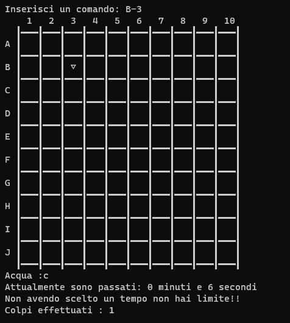

Nel caso l'utente inserisca il comando "/abbandona" verrà prima chiesta conferma di abbandono, in caso di risposta affermativa l'applicazione risponderà visualizzando la griglia con la posizione di tutte le navi e si predispone a ricevere nuovi comandi. Nel caso di risposta negativa l'applicazione si predispone a ricevere nuovi comandi  Chiamabile solo a partita in corso:

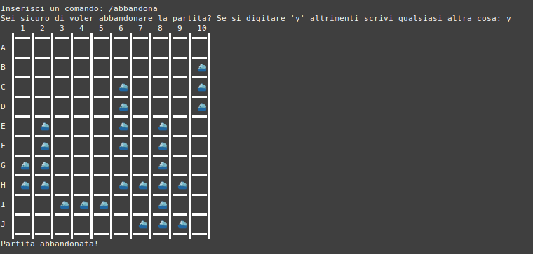

Nel caso l'utente inserisca il comando "/esci" prima gli verrà chiesta conferma di uscita e in seguito ad un risposta affermativa l'applicazione si chiuderà:

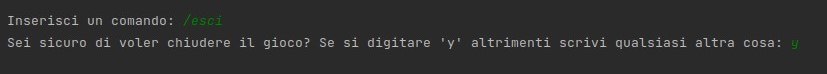

---

## 8)PROCESSO DI SVILUPPO E ORGANIZZAZIONE DEL LAVORO
Per rispettare al meglio i principi dello Scrum, si è deciso di seguire le seguenti regole:
- all’inizio di ogni sprint c’è stata una riunione di gruppo riguardante lo sprint backlog e la divisione delle issue, oltre che la presa visione di eventuali errori segnalati nello sprint precedente.
- alla fine di ogni sprint è stata svolta una riunione volta ad effettuare un’ultima revisione su tutto il lavoro svolto e alla stesura dell’analisi retrospettiva
- sono state effettuate brevi riunioni da remoto a cadenza giornaliera (per quanto possibile nei giorni lavorativi) volte ad aggiornarsi sul lavoro fatto e a chiarire eventuali dubbi reciproci.
In particolare, nei singoli sprint si è lavorato in questo modo:

### 8.1)SPRINT 0
Dopo una riunione all’inizio dello sprint in cui sono stati divisi i compiti e chiarite le varie modalità di lavoro, ogni membro del gruppo ha lavorato singolarmente seguendo il GitHub Flow. Al presentarsi di difficoltà o dubbi da parte di uno o piu membri del team, sono state svolte brevi riunioni volte a risolverli.

### 8.2)SPRINT 1
I membri del team hanno passato diversi giorni riuniti per definire il modello di dominio dell’applicazione, su cui poi si è basata la progettazione e realizzazione del codice. La realizzazione del codice delle classi di base è stata svolta da due membri del gruppo, ma revisionato da tutti quanti i membri a cadenza giornaliera. Dopo la realizzazione e caricamento delle classi di base, ogni membro ha lavorato singolarmente alle user story seguendo il GitHub Flow. Le revisioni di queste sono state svolte a rotazione da ogni membro del gruppo. Ogni membro del team si è impegnato a commentare e testare (manualmente) il codice scritto. Tutti i membri hanno lavorato congiuntamente alla stesura della relazione tecnica, pur essendo questa corretta e caricata da uno specifico membro

### 8.3)SPRINT 2
I membri del team hanno lavorato al completamento delle singole user story e alla correzione/revisione degli errori segnalati dallo sprint precedente. Anche in questo caso le revisioni sono state svolte a rotazione. C’è stata una fase di adattamento del progetto alla tassonomia ECB e ai principi di design, svolta in pair programming da due membri del gruppo ma revisionata da tutti i membri. I casi di test sono stati decisi congiuntamente da tutto il gruppo, ma implementati in JUnit da due membri alla fine della realizzazione del codice. La correzione del modello di dominio e la parte di report riguardante l’OO design e il system design sono state curate da tutto il gruppo. Ogni membro si è impegnato a commentare il codice scritto e a correggere/migliorare i commenti scritti precedentemente.

---
## 9)RETROSPETTIVA
Di seguito la retrospettiva degli sprint precedenti. Sono state raccolte le  osservazioni e le opinioni dei membri del team riguardo al lavoro svolto in un modello di retrospettiva "sad,mad,glad".
### 9.1) SPRINT 0

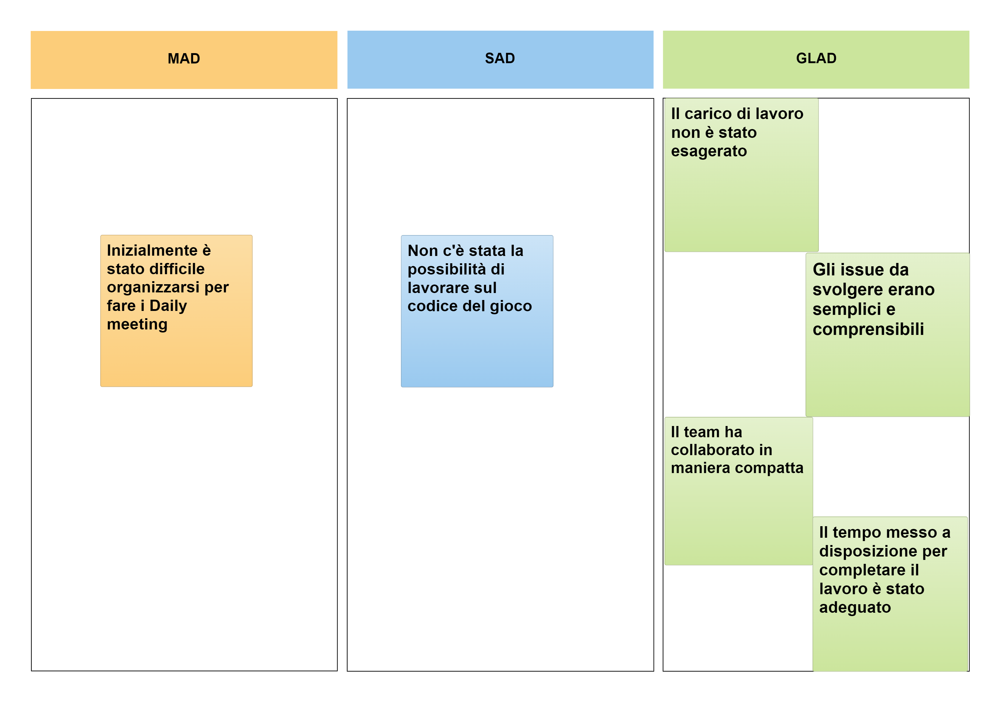

### 9.1) SPRINT 1

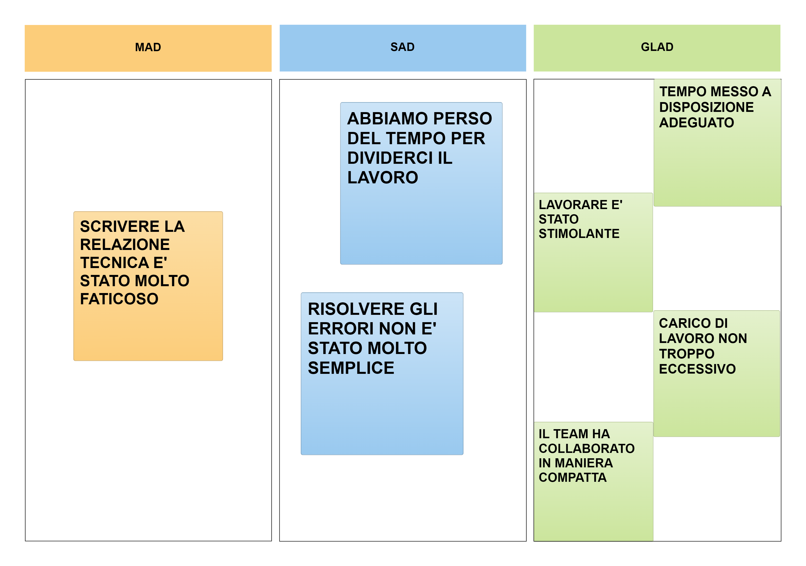

