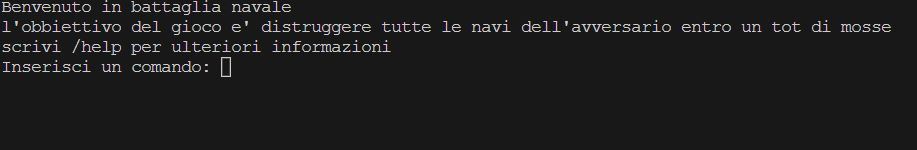

# Report
---

## 1)INTRODUZIONE
Il gioco realizzato è quello della battaglia navale, con una versione a giocatore singolo contro la CPU. Di seguito le regole del gioco:
* Il sistema posiziona casualmente le navi su una griglia 10x10. Le navi posizionate sono molteplici: 
    * Cacciatorpediniere (4 esemplari,2 caselle);
    * Incrociatore (3 esemplari, 3 caselle);
    * Corazzata (2 esemplari, 4 caselle);
    * Portaerei (1 esemplari, 5 caselle).
* Il giocatore cerca di indovinare la posizione delle navi e affondarle 
* Il giocatore vince se affonda tutte le navi prima di esaurire le mosse 
* Il numero di mosse disponibili dipende dalla modalità di gioco (facile/media/difficile/…)

---

## 2)MODELLO DI DOMINIO
Il modello di dominio è un diagramma delle classi con prospettive concettuali, esso è una visuale di concetti caratteristici del dominio studiato

---
## 3)REQUISITI SPECIFICI
Di seguito si riporta l'elenco dei requisiti che l'applicazione soddisfa, divisi in requisiti funzionali (le funzionalità che devono essere fruibili dall'utente) e requisiti non funzionali (le caratteristiche che l'applicazione dovrà avere in merito alla sua esecuzione):
#### 3.1 REQUISITI FUNZIONALI
Attori/utenti del sistema: giocatore della partita.
* **RF1**: Come giocatore voglio mostrare l’help con elenco comandi
* **RF2**: Come giocatore voglio chiudere il gioco
* **RF3**:Come giocatore voglio impostare il livello di gioco per variare il numero massimo di tentativi sbagliati
* **RF4**: Come giocatore voglio mostrare il livello di gioco e il numero massimo di tentativi falliti
* **RF5**: Come giocatore voglio mostrare i tipi di nave e il numero di esemplari per ogni tipo
* **RF6**: Come giocatore voglio iniziare una nuova partita
* **RF7**: Come giocatore voglio svelare la griglia con le navi posizionate

#### 3.2 REQUISITI NON FUNZIONALI
**RNF1**: il container docker dell’app deve essere eseguito da terminali che supportano Unicode con encoding UTF-8 o UTF-16. Alcuni dei terminali supportati sono:
*	Terminal di Linux
*	Powershell Windows
*	Git Bash (in questo caso il comando Docker ha come prefisso winpty; es: winpty docker -it ....)

----

## 7)MANUALE UTENTE
Nel caso l'utente avvii il programma senza inserire nessun parametro verrà mostrato questo:

Nel caso l'utente avvii il programma inserendo il parametro "--help" oppure "-help" verrà mostrato questo:

Nel caso l'utente inserisca /help per avere piu' informazioni verrà stampato questo:

Nel caso l'utente inserisca il comando /gioca verrà iniziata una nuova partita:

Nel caso l'utente inserisca il comando /mostranavi verrà stampata una legende delle navi disponibili:

Nel caso l'utente (a partita in corso) inserisca il comando /svelagriglia verrà mostrata la griglia con le navi posizionate:

Nel caso l'utente inserisca il comando /mostralivello verrà visualizzato il livello al quale l'utente sta giocando, il livello è impostabile quando la partita inizia (tramite i comandi "/facile", "/medio", "/difficile") e non è modificabile a partita in corso:

Nel caso l'utente inserisca il comando "/esci" prima gli verrà chiesta conferma di uscita e in seguito ad un risposta affermativa l'applicazione si chiuderà:

---

## 9)RETROSPETTIVA
Di seguito la retrospettiva degli sprint precedenti. Sono state raccolte le 
osservazioni e le opinioni dei membri del team riguardo al lavoro svolto in
un modello di retrospettiva "sad,mad,glad".
### 9.1) SPRINT 0

